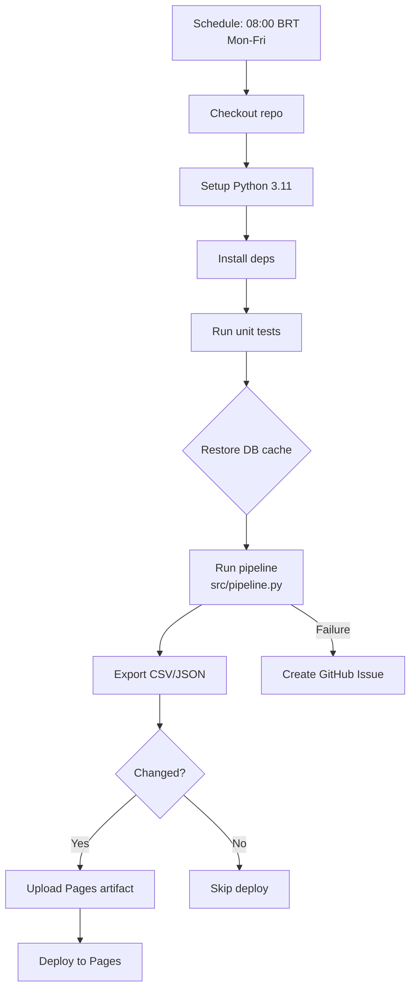

# Arquitetura do Radar Fundamentalista B3

> **Visão geral completa**: Veja o diagrama interativo em [`docs/architecture.html`](architecture.html)

## Visão Geral

O **Radar Fundamentalista B3** segue o padrão **ETL → Static Site**:

1. **Extrair**: Dados de fontes públicas (brapi.dev + yfinance)
2. **Transformar**: Análise fundamentalista (Graham, Bazin, scorecards)
3. **Carregar**: Persistência em SQLite
4. **Gerar**: Dashboard HTML estático com Jinja2
5. **Deploy**: GitHub Actions → GitHub Pages

## Componentes

```
┌─────────────────────────────────────────────────────────────┐
│                    GitHub Actions (CI/CD)                    │
│  ┌──────────┐  ┌──────────┐  ┌──────────┐  ┌────────────┐  │
│  │  Tests   │  │ Pipeline │  │  Export  │  │ Pages Deploy│  │
│  └──────────┘  └──────────┘  └──────────┘  └────────────┘  │
└─────────────────────────────────────────────────────────────┘
                          │
┌─────────────────────────────────────────────────────────────┐
│                        src/pipeline.py                       │
│                    Orquestrador CLI/DAEMON                    │
└─────────────────────────────────────────────────────────────┘
         │                  │                  │
┌─────────────────┐ ┌─────────────────┐ ┌─────────────────┐
│   src/sources.py │ │ src/ingestion.py│ │ src/generator.py│
│  Fontes de Dados │ │  Ingestão +     │ │  Geração do     │
│  brapi.dev + yf  │ │  Análise + DB   │ │  Dashboard HTML │
└─────────────────┘ └─────────────────┘ └─────────────────┘
         │                  │                  │
         ▼                  ▼                  ▼
┌─────────────────┐ ┌─────────────────┐ ┌─────────────────┐
│  BrapiClient    │ │  src/analyzer.py│ │  dashboard.html │
│  YfinanceClient │ │  Graham, Bazin, │ │  Chart.js + PWA │
│  (fallback)     │ │  Score 0-5      │ │  (7.9K lines)   │
└─────────────────┘ └─────────────────┘ └─────────────────┘
         │                  │
         ▼                  ▼
┌─────────────────┐ ┌─────────────────┐
│  src/database.py│ │  data/          │
│  SQLite CRUD    │ │  investments.db │
│  + migrations   │ │  + exports      │
└─────────────────┘ └─────────────────┘
```

## Fluxo de Dados

```
           ┌──────────┐
           │ tickers  │
           │ .json    │
           └────┬─────┘
                ▼
┌───────────────────────────────┐
│   src/ingestion.py            │
│                               │
│   1. Load config + mappings   │
│   2. Resolve tickers           │
│   3. Fetch via brapi.dev      │
│   4. Fallback: yfinance       │
│   5. Analyze (analyzer.py)    │
│   6. Save to SQLite           │
│   7. Log results              │
└───────────────┬───────────────┘
                ▼
┌───────────────────────────────┐
│   data/investments.db         │
│   ┌─────────┬──────┬───────┐  │
│   │ stocks  │ fiis │ fiagr │  │
│   │         │      │ os    │  │
│   └─────────┴──────┴───────┘  │
└───────────────┬───────────────┘
                ▼
┌───────────────────────────────┐
│   src/generator.py            │
│                               │
│   1. Read all assets from DB  │
│   2. Load indices + mappings  │
│   3. Compute sector sums      │
│   4. Render Jinja2 template   │
│   5. Write dashboard.html     │
└───────────────┬───────────────┘
                ▼
┌───────────────────────────────┐
│      GitHub Pages             │
│   https://jucelinoss.github   │
│   .io/radar_fundamentalista   │
│   _b3/                        │
└───────────────────────────────┘
```

## GitHub Actions Flow



## Qualidade do Código

### Pontos Fortes
- ✅ Type hints em todos os 8 módulos
- ✅ Testes unitários (86 passando, 35 skipped)
- ✅ CI/CD automatizado com GitHub Actions
- ✅ Sem sys.path hacks (pacote próprio)
- ✅ Constantes mágicas extraídas
- ✅ Logging centralizado
- ✅ MockResponse compartilhado entre testes
- ✅ Helpers de teste em utils.py
- ✅ Config files sincronizados

### A Melhorar
| Item | Impacto | Esforço |
|------|---------|---------|
| Cobrir server.py, generator.py, exporter.py com testes | Médio | Médio |
| Substituir DB_PATH global por classe Database | Médio | Pequeno |
| Adicionar pre-commit hooks (ruff, mypy) | Alto | Pequeno |
| CI em push para dev branch | Alto | Pequeno |
| Dockerfile para deploy containerizado | Médio | Médio |
| Validação de schema do config/tickers.json | Baixo | Pequeno |
| Template Jinja2 muito grande (1953 linhas) | Médio | Grande |
| Error handling inconsistente em sources.py | Médio | Pequeno |

## Stack Tecnológica

| Camada | Tecnologia |
|--------|-----------|
| **Linguagem** | Python 3.12 |
| **Fontes de Dados** | brapi.dev API + yfinance |
| **Banco** | SQLite |
| **Template** | Jinja2 |
| **Gráficos** | Chart.js (CDN) |
| **Export** | CSV, JSON |
| **Testes** | pytest + pytest-mock |
| **CI/CD** | GitHub Actions |
| **Hospedagem** | GitHub Pages |
| **PWA** | Service Worker + Manifest |
